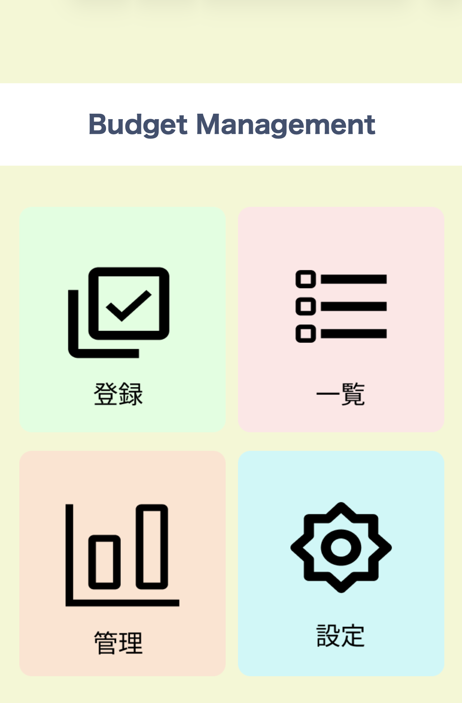
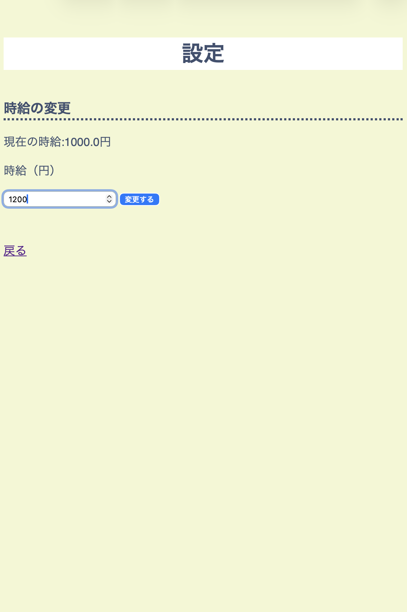
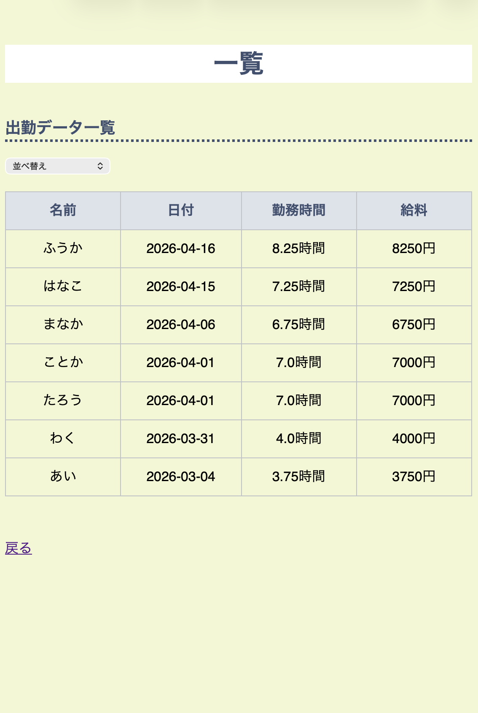
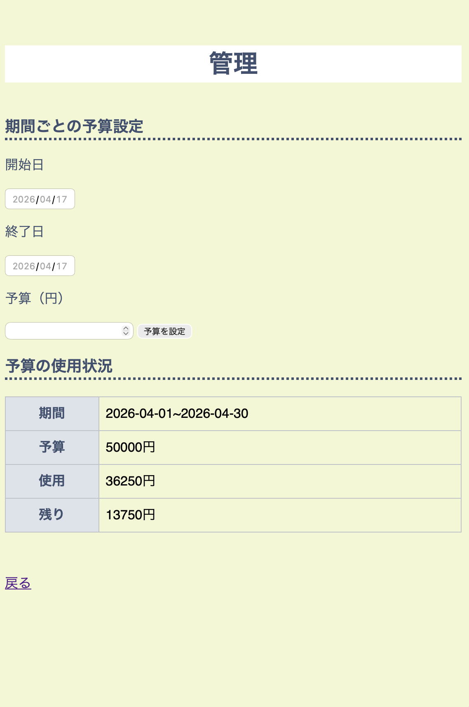

# 予算管理のWebアプリ

## 概要
アルバイトの予算管理を効率化するためのWebアプリです。

## 機能
・勤務時間の登録  
・給料の自動計算  
・一覧表示（ソート機能あり）  
・期間ごとの予算管理  
・時給設定  

## 使用技術
・Python（Flask）  
・HTML / CSS  

## 環境構築
[Mac / Linux]

```bash
git clone https://github.com/nnklst88/budget-app.git
cd budget-app
python3 -m venv venv
source venv/bin/activate
pip install -r requirements.txt
python app.py
```

起動後、ブラウザで以下にアクセスしてください：
http://localhost:5000

[Windows]

```bash
git clone https://github.com/nnklst88/budget-app.git
cd budget-app
python -m venv venv
venv\Scripts\activate
pip install -r requirements.txt
python app.py
```

起動後、ブラウザで以下にアクセスしてください：
http://localhost:5000

## 使い方
### ⓪ ホーム画面
それぞれの画面に遷移します。


### ① 設定画面
最初に時給を設定します。
初期設定は、1000円です。


### ② 登録画面
勤務日、開始時間と終了時間、休憩時間を入力して登録します。


### ③ 一覧画面
登録したデータと計算された給料を一覧で確認できます。


### ④管理画面
期間の開始日と終了日を入力し、予算を設定します。
設定した期間内で使用した金額をもとに、残りの予算が自動で表示されます。

