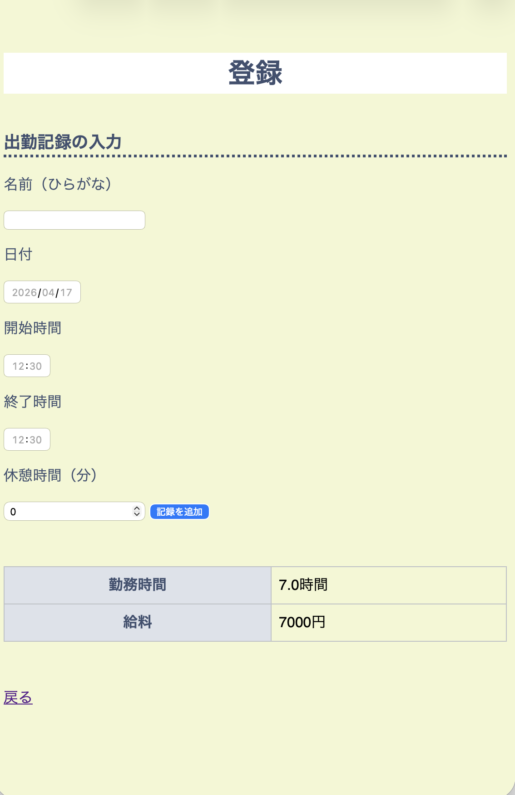

# Budget Management App

### アルバイトの給与・予算管理を一元化するアプリ

## 📌概要
大学生が主体となるアルバイトでの「予算管理の複雑さ」を解消するためのWebアプリです。
複数人の出勤量を調整し、予算内で管理することが目的となります。
これまで、LINEでの出勤時間の報告とExcelへの手入力で行っていた作業を、このWebアプリに集約することで、入力の二度手間や計算ミスを防止します。

## 🚀機能
・勤務時間の登録  
・給料の自動計算  
・一覧表示（ソート機能あり）  
・期間ごとの予算管理  
・時給設定

## 🌐公開URL(App Demo)
https://nnklset88.pythonanywhere.com<br>
<br>
※ブラウザから直接操作いただけます。

## ⚒️使用技術
【バックエンド】<br>
 ・Python（Flask）<br>
【フロントエンド】<br>
 ・HTML/CSS<br>
【デプロイ・公開】<br>
 ・PythonAnywhere<br>
【開発環境】<br>
 ・Visual Studio Code<br>
 ・AIツール（実装調査・エラー解決の補助）<br>

## 💻環境構築

### Mac / Linux
```bash
git clone https://github.com/nnklst88/budget-app.git
cd budget-app
python3 -m venv venv
source venv/bin/activate
pip install -r requirements.txt
python app.py
```
起動後、ブラウザで以下にアクセスしてください：
http://localhost:5000

### Windows
```bash
git clone https://github.com/nnklst88/budget-app.git
cd budget-app
python -m venv venv
venv\Scripts\activate
pip install -r requirements.txt
python app.py
```

起動後、ブラウザで以下にアクセスしてください：
http://localhost:5000

## 📕使い方
### ⓪ ホーム画面
各機能画面に遷移します。<br>


### ① 設定画面
時給の設定をします。（初期値:1000円）<br>


### ② 登録画面
名前、日付、開始時間・終了時間、休憩時間(分）を入力して、登録します。<br>


### ③ 一覧画面
登録したデータと計算された給料を一覧で確認できます。<br>


### ④管理画面
期間の開始日と終了日を入力し、予算を設定します。<br>
設定した期間内で使用した金額をもとに、残りの予算が自動で表示されます。<br>

